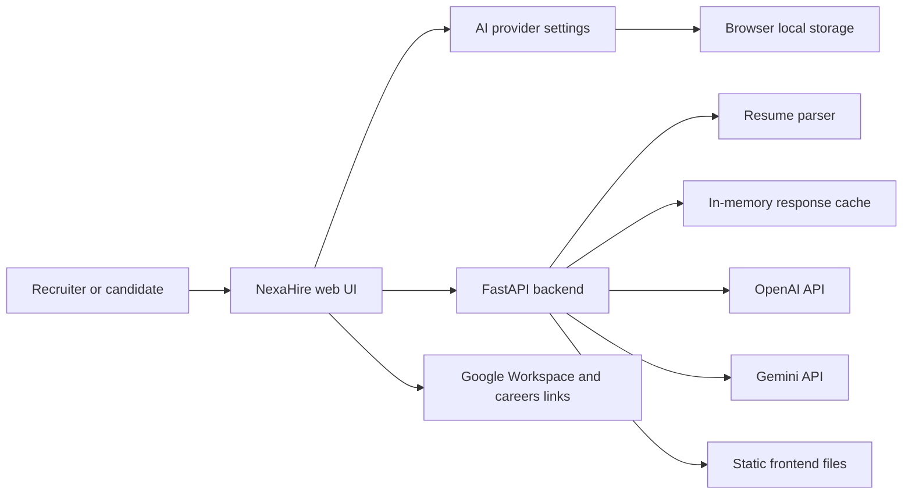

# NexaHire AI

<p align="center">
  
</p>

<h3 align="center">Talent Intelligence OS for explainable recruiting intelligence</h3>

<p align="center">
  Analyze resumes, match candidates, run AI interviews, review bias, coach careers, create outreach, and hand off recruiter work into a Google-ready command center.
</p>

<p align="center">
  <a href="#quick-start"></a>
  <a href="#deploy-to-google-cloud-run"></a>
  <a href="#ai-provider-setup"></a>
  <a href="#tech-stack"></a>
  <a href="#docker"></a>
</p>

<p align="center">
  
</p>

---

## Overview

NexaHire AI is a polished recruiting command center built for resume intelligence, candidate-job matching, interview practice, bias review, Google Workspace handoffs, career coaching, and personalized outreach.

The app is designed to feel like a real AI product, not a static demo. Recruiters can upload resumes, view graph-based scoring, save a profile, inspect live job requirement cards, open official company career pages, and choose their preferred AI provider directly from the interface.

The current backend supports:

- OpenAI Chat Completions.
- Gemini Generate Content API.
- Per-user API keys entered from the browser.
- Server-side API keys from `.env`, Docker, or Google Cloud Secret Manager.
- PDF, DOCX, TXT, and DOC resume parsing.
- Same-origin API routing for simple GCP deployment.

---

## Product Experience

### Command Center

NexaHire opens into a professional talent intelligence dashboard with:

- Cinematic launch loading screen.
- Light and dark theme toggle.
- Recruiter profile builder with photo upload.
- Saved profile preview that hides the edit form after save.
- AI model access panel with OpenAI/Gemini choice.
- Live model verification status.
- Command navigation for Home, Analyze, Match, Interview, Bias, Coach, and Outreach.
- Live requirements section with company logos and official career links.
- Google-ready recruiter actions for Gmail, Calendar, Meet, Drive, Sheets, and Google Careers.

### Resume Intelligence

The resume analyzer produces:

- Overall candidate score.
- Resume scoring graph.
- Skills depth.
- Project impact.
- Experience alignment.
- Education strength.
- Communication signal.
- Growth signal.
- Strengths and weaknesses.
- Domain expertise.
- Recruiter notes.
- Recommendations for interview validation.

### Smart Matching

The matching engine compares resume text with a job description and returns:

- Match score.
- Confidence.
- Overall fit.
- Skills match.
- Experience alignment.
- Culture fit.
- Growth potential.
- Skill-by-skill explanation.
- Gaps and hiring suggestion.

### Interview, Bias, Coach, Outreach

NexaHire also includes:

- AI Interviewer: role-specific interview questions, scoring, feedback, and improvement plan.
- Bias Detector: biased language detection, severity score, issue list, and inclusive rewrite.
- Career Coach: readiness score, roadmap, courses, project ideas, and timeline.
- Smart Outreach: email, LinkedIn/InMail, and follow-up message generation.

---

## AI Provider Setup

NexaHire now includes an in-app AI settings section so each user can connect their own model access.

### In-App Flow

1. Open the app.
2. Go to the AI model access panel.
3. Choose `OpenAI` or `Gemini`.
4. Select a model.
5. Paste your API key.
6. Click `Verify`.
7. Save the configuration.

The app will show a live status for the selected provider and model.

### Supported UI Model Choices

| Provider | Models |
| --- | --- |
| OpenAI | `gpt-4.1-mini`, `gpt-4.1`, `gpt-4o-mini`, `gpt-4o` |
| Gemini | `gemini-2.5-flash`, `gemini-2.5-pro`, `gemini-2.0-flash`, `gemini-2.0-flash-lite` |

### Server Fallback

If a user does not enter a browser API key, the backend uses the server environment:

```env
AI_PROVIDER=openai
OPENAI_API_KEY=your_openai_api_key_here
GEMINI_API_KEY=your_gemini_api_key_here
MODEL=gpt-4.1-mini
GEMINI_MODEL=gemini-2.0-flash
MAX_TOKENS=2000
CACHE_TTL=3600
```

Do not commit real API keys. Keep them in `.env` locally and Secret Manager on GCP.

---

## Architecture



### Runtime Flow

1. User uploads a resume or submits a workflow form.
2. Frontend attaches selected AI provider, model, and optional browser API key.
3. FastAPI resolves the request-level AI config.
4. Backend parses files and builds structured prompts.
5. OpenAI or Gemini returns structured JSON.
6. Frontend renders scores, graphs, notes, recommendations, and actions.

---

## Tech Stack

| Layer | Technology |
| --- | --- |
| Frontend | HTML5, CSS3, Vanilla JavaScript |
| Styling | Responsive light/dark command center UI |
| Backend | Python 3.10+, FastAPI |
| AI | OpenAI Chat Completions, Gemini Generate Content |
| File Parsing | PyPDF2, python-docx |
| Runtime | Uvicorn |
| Container | Docker |
| Cloud Target | Google Cloud Run |
| Secrets | `.env` locally, Secret Manager in production |

---

## Project Structure

```text
NexaHire-AI/
|-- assets/
|   |-- bg.png
|   |-- nexahire-mark.svg
|   `-- talentsync-mark.svg
|-- backend/
|   `-- app.py
|-- index.html
|-- style.css
|-- script.js
|-- requirements.txt
|-- Dockerfile
|-- docker-compose.yml
|-- .env.example
|-- .gcloudignore
|-- .dockerignore
|-- .gitignore
`-- README.md
```

---

## Quick Start

### 1. Requirements

- Python 3.10 or newer.
- Modern browser.
- OpenAI API key or Gemini API key.

### 2. Create Environment

Windows PowerShell:

```powershell
python -m venv .venv
.\.venv\Scripts\Activate.ps1
pip install -r requirements.txt
copy .env.example .env
```

macOS or Linux:

```bash
python3 -m venv .venv
source .venv/bin/activate
pip install -r requirements.txt
cp .env.example .env
```

### 3. Add API Keys

Edit `.env`:

```env
AI_PROVIDER=openai
OPENAI_API_KEY=your_openai_api_key_here
GEMINI_API_KEY=your_gemini_api_key_here
MODEL=gpt-4.1-mini
GEMINI_MODEL=gemini-2.0-flash
MAX_TOKENS=2000
CACHE_TTL=3600
```

You can also leave `.env` without keys and enter the API key inside the app's AI model access panel.

### 4. Run Locally

```bash
python backend/app.py
```

Open:

```text
http://127.0.0.1:8000/
```

### 5. Check Health

```bash
curl http://127.0.0.1:8000/health
```

Example response:

```json
{
  "status": "healthy",
  "provider": "openai",
  "model": "gpt-4.1-mini",
  "api_key_configured": true,
  "providers": {
    "openai": true,
    "gemini": false
  },
  "pdf": true,
  "docx": true
}
```

---

## Docker

Build and run with Docker Compose:

```bash
docker compose up --build
```

Open:

```text
http://127.0.0.1:8000/
```

Run a production-style container:

```bash
docker build -t nexahire-ai .
docker run --env-file .env -p 8080:8080 nexahire-ai
```

Open:

```text
http://127.0.0.1:8080/
```

---

## Deploy To Google Cloud Run

Cloud Run is the recommended Google Cloud Platform deployment target because NexaHire is a containerized HTTP app with a FastAPI backend and static frontend.

### Deployment Checklist

- Google Cloud project created.
- Billing enabled.
- `gcloud` CLI installed.
- Cloud Run, Cloud Build, Artifact Registry, and Secret Manager APIs enabled.
- OpenAI and/or Gemini key available.
- No real keys committed to git.

### 1. Authenticate And Select Project

```bash
gcloud auth login
gcloud config set project YOUR_PROJECT_ID
```

Set a region. `asia-south1` is a good default for India:

```bash
gcloud config set run/region asia-south1
```

### 2. Enable GCP Services

```bash
gcloud services enable run.googleapis.com
gcloud services enable cloudbuild.googleapis.com
gcloud services enable artifactregistry.googleapis.com
gcloud services enable secretmanager.googleapis.com
```

### 3. Create Secrets

Create an OpenAI secret:

```bash
printf "YOUR_OPENAI_API_KEY" | gcloud secrets create openai-api-key --data-file=-
```

Create a Gemini secret:

```bash
printf "YOUR_GEMINI_API_KEY" | gcloud secrets create gemini-api-key --data-file=-
```

If a secret already exists, add a new version:

```bash
printf "YOUR_OPENAI_API_KEY" | gcloud secrets versions add openai-api-key --data-file=-
printf "YOUR_GEMINI_API_KEY" | gcloud secrets versions add gemini-api-key --data-file=-
```

Windows PowerShell alternative:

```powershell
"YOUR_OPENAI_API_KEY" | gcloud secrets create openai-api-key --data-file=-
"YOUR_GEMINI_API_KEY" | gcloud secrets create gemini-api-key --data-file=-
```

### 4. Deploy From Source

This is the simplest Cloud Run deployment:

```bash
gcloud run deploy nexahire-ai \
  --source . \
  --region asia-south1 \
  --allow-unauthenticated \
  --set-secrets OPENAI_API_KEY=openai-api-key:latest,GEMINI_API_KEY=gemini-api-key:latest \
  --set-env-vars AI_PROVIDER=openai,MODEL=gpt-4.1-mini,GEMINI_MODEL=gemini-2.0-flash,MAX_TOKENS=2000,CACHE_TTL=3600 \
  --memory 1Gi \
  --cpu 1 \
  --timeout 300
```

Cloud Run will build the Dockerfile, deploy the service, and print the public service URL.

### 5. Verify Deployment

Get the service URL:

```bash
gcloud run services describe nexahire-ai \
  --region asia-south1 \
  --format="value(status.url)"
```

Check health:

```bash
curl "https://YOUR_CLOUD_RUN_URL/health"
```

Expected response shape:

```json
{
  "status": "healthy",
  "provider": "openai",
  "model": "gpt-4.1-mini",
  "api_key_configured": true,
  "providers": {
    "openai": true,
    "gemini": true
  }
}
```

### 6. Read Cloud Run Logs

```bash
gcloud run services logs read nexahire-ai \
  --region asia-south1 \
  --limit 100
```

Stream recent logs while testing:

```bash
gcloud beta run services logs tail nexahire-ai \
  --region asia-south1
```

### 7. Update Environment Variables

Switch default provider to Gemini:

```bash
gcloud run services update nexahire-ai \
  --region asia-south1 \
  --update-env-vars AI_PROVIDER=gemini,GEMINI_MODEL=gemini-2.0-flash
```

Switch default provider back to OpenAI:

```bash
gcloud run services update nexahire-ai \
  --region asia-south1 \
  --update-env-vars AI_PROVIDER=openai,MODEL=gpt-4.1-mini
```

### 8. Redeploy After Code Changes

```bash
gcloud run deploy nexahire-ai \
  --source . \
  --region asia-south1
```

The included `.gcloudignore` keeps local environments, secrets, caches, zips, git history, and unused large assets out of the deployment upload.

---

## API Reference

### Health

```http
GET /health
```

Returns backend status, selected default provider, default model, key availability, and resume parser support.

### Verify AI Provider

```http
POST /api/ai/verify
Content-Type: application/json
```

```json
{
  "provider": "openai",
  "model": "gpt-4.1-mini",
  "api_key": "optional_user_key"
}
```

If `api_key` is empty, the server tries the configured environment key.

### Analyze Resume

```http
POST /api/analyze-resume
Content-Type: multipart/form-data
```

Form field:

```text
file=resume.pdf
```

Returns candidate scoring, skills, project analysis, graph data, recommendations, and recruiter notes.

### Match Candidate

```http
POST /api/match
Content-Type: application/json
```

```json
{
  "resume_text": "Candidate resume text",
  "job_description": "Target job description"
}
```

### AI Interview

```http
POST /api/interview
Content-Type: application/json
```

```json
{
  "message": "Candidate answer",
  "role": "Software Engineer",
  "history": [],
  "difficulty": "medium"
}
```

### Detect Bias

```http
POST /api/detect-bias
Content-Type: application/json
```

```json
{
  "job_description": "Job description text"
}
```

### Career Coach

```http
POST /api/career-coach
Content-Type: application/json
```

```json
{
  "current_skills": "Python, React, SQL",
  "target_role": "Senior AI Engineer",
  "experience_level": "mid"
}
```

### Generate Outreach

```http
POST /api/generate-outreach
Content-Type: application/json
```

```json
{
  "candidate_name": "Alex Chen",
  "candidate_skills": "Python, AWS, FastAPI",
  "target_role": "Senior AI Engineer",
  "company_name": "NexaHire AI",
  "tone": "professional"
}
```

---

## Example Resume Analysis Response

```json
{
  "candidate_score": 94,
  "experience_level": "senior",
  "score_breakdown": {
    "skills_depth": 91,
    "project_impact": 88,
    "experience_alignment": 94,
    "education_strength": 78,
    "communication_signal": 86,
    "growth_signal": 88
  },
  "skills": {
    "technical": ["Python", "FastAPI", "Machine Learning", "Cloud"],
    "soft": ["communication", "ownership", "mentoring"],
    "tools": ["Docker", "GCP", "GitHub"]
  },
  "career_trajectory": "strong upward progression",
  "summary": "Cloud, ML systems, and product delivery align strongly with the target role.",
  "graph_insights": [
    "Skills depth and experience alignment are the strongest hiring signals.",
    "System design depth should be validated in interview."
  ],
  "recruiter_notes": [
    "Prepare architecture questions around distributed AI systems.",
    "Outreach personalization is ready for review."
  ]
}
```

---

## Environment Variables

| Variable | Required | Default | Description |
| --- | --- | --- | --- |
| `AI_PROVIDER` | No | `openai` | Default server provider: `openai` or `gemini` |
| `OPENAI_API_KEY` | Optional | None | OpenAI key for server-side calls |
| `GEMINI_API_KEY` | Optional | None | Gemini key for server-side calls |
| `MODEL` | No | `gpt-4.1-mini` | Default OpenAI model |
| `GEMINI_MODEL` | No | `gemini-2.0-flash` | Default Gemini model |
| `MAX_TOKENS` | No | `2000` | Maximum output tokens |
| `CACHE_TTL` | No | `3600` | Response cache duration in seconds |
| `PORT` | No | `8000` locally, `8080` in container | HTTP port |

---

## Production Notes

### Security

- Never commit `.env`.
- Never paste real keys into `README.md`, frontend code, screenshots, or issue comments.
- Use Google Secret Manager for production API keys.
- Browser-entered keys stay in that user's browser storage and are sent only with AI requests.
- Add authentication before storing candidate data for a real team.
- Restrict CORS to trusted domains for production.

### Scaling

- Cloud Run can scale from zero.
- Use at least `1Gi` memory for comfortable PDF/DOCX parsing.
- Increase timeout for long resumes or slower model responses.
- Add persistent storage if you want shared team profile history.
- Add Firestore, Cloud SQL, or Cloud Storage for production candidate records.

### Cost Control

- Prefer `gpt-4.1-mini` or `gemini-2.0-flash` for everyday testing.
- Use stronger models only for final analysis or high-value workflows.
- Keep `MAX_TOKENS` reasonable.
- Use the built-in cache to reduce repeated AI calls during demos.

---

## Troubleshooting

### App Opens But AI Calls Fail

Check:

```bash
curl http://127.0.0.1:8000/health
```

If `api_key_configured` is `false`, add a key in `.env` or use the in-app AI model access panel.

### Gemini Quota Error

Gemini may return `RESOURCE_EXHAUSTED` when the selected model has no free-tier quota. Fix it by:

- Switching to OpenAI in the AI settings panel.
- Choosing another Gemini model.
- Enabling billing or increasing quota in Google AI Studio.
- Waiting for quota reset.

### OpenAI Key Error

Check:

- The key is active.
- Billing is enabled.
- The selected model is available to your account.
- The key was pasted without spaces.

### Cloud Run Build Fails

Read build logs:

```bash
gcloud builds list --limit 5
gcloud builds log BUILD_ID
```

Confirm these files are present:

```text
Dockerfile
requirements.txt
backend/app.py
index.html
style.css
script.js
```

### Cloud Run Service Starts But Shows 503

Check logs:

```bash
gcloud run services logs read nexahire-ai \
  --region asia-south1 \
  --limit 100
```

Most common causes:

- Missing `PORT` handling.
- Missing dependency in `requirements.txt`.
- Invalid environment variable.
- Secret not attached to the service.

### Resume Upload Fails

Check that the file is one of:

```text
PDF, DOCX, TXT, DOC
```

For scanned image-only PDFs, OCR is not included yet.

---

## Useful Commands

Run local server:

```bash
python backend/app.py
```

Run with Uvicorn:

```bash
uvicorn backend.app:app --host 0.0.0.0 --port 8000 --reload
```

Check backend health:

```bash
curl http://127.0.0.1:8000/health
```

Verify OpenAI through API:

```bash
curl -X POST http://127.0.0.1:8000/api/ai/verify \
  -H "Content-Type: application/json" \
  -d "{\"provider\":\"openai\",\"model\":\"gpt-4.1-mini\",\"api_key\":\"\"}"
```

Verify Gemini through API:

```bash
curl -X POST http://127.0.0.1:8000/api/ai/verify \
  -H "Content-Type: application/json" \
  -d "{\"provider\":\"gemini\",\"model\":\"gemini-2.0-flash\",\"api_key\":\"\"}"
```

Check Python syntax:

```bash
python -m py_compile backend/app.py
```

---

## Roadmap

- Google OAuth for Gmail draft creation.
- Google Calendar interview scheduling.
- Google Drive resume import and report export.
- Google Sheets shortlist sync.
- Candidate database and ranking board.
- Team authentication.
- PDF report generation.
- Interview transcript export.
- Multi-language resume support.
- Live role monitoring with scheduled refresh.
- Admin analytics for recruiting teams.

---

## Deployment Summary

For GCP, the recommended production path is:

1. Add API keys to Secret Manager.
2. Deploy with Cloud Run from source.
3. Use `--set-secrets` for `OPENAI_API_KEY` and `GEMINI_API_KEY`.
4. Use `--set-env-vars` for provider/model defaults.
5. Verify `/health`.
6. Watch logs with `gcloud run services logs read`.

NexaHire is ready for local demos, Docker runs, and Cloud Run deployment.

---

## License

MIT License.

